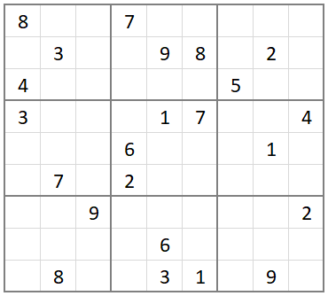

# Sudoku Solver
## Description
This is a Sudoku puzzle (9x9) solver using hidden singles and backtracking.

## Usage
The puzzle should be a 9x9 list of intergers with unfilled cells marked as `0`.  
Eg:  
  


### Python
Above puzzle should be input as a 9x9 list:
```
puzzle = [  
    [8,0,0,7,0,0,0,0,0],  
    [0,3,0,0,9,8,0,2,0],  
    [4,0,0,0,0,0,5,0,0],  
    [3,0,0,0,1,7,0,0,4],  
    [0,0,0,6,0,0,0,1,0],  
    [0,7,0,2,0,0,0,0,0],  
    [0,0,9,0,0,0,0,0,2],  
    [0,0,0,0,6,0,0,0,0],  
    [0,8,0,0,3,1,0,9,0]]
```

Import the module and use `.solve(puzzle)` to initiate solving.

```
import sudoku_solver as sk  

solved_puzzle = sk.solve(puzzle)
```
It returns the solved puzzle if the puzzle is solved. Otherwise None.  
There will be an output to the console that indicates level of recursion and iterations in each level.  
```
Level 1:
	Iterations: 1 2 3 4 5 6 7 8 9 10 11 
	Level 2:
		Iterations: 1 2 3 
		Level 3:
			Iterations: 1 
			Level 4:
				Iterations: 1 2 3 4 5 6 7 8 9 
Puzzle solved
```

### C++

The puzzle should be a 9x9 int array.

Include the `solver.h` library and use `.Solve(puzzle)` to initiate solving.

```
#include "solver.h"

int main(){
    Solver s;
    int puzzle[][9] = 
    { {0, 0, 0, 0, 0, 0, 0, 8, 4},
        {0, 0, 0, 1, 0, 0, 0, 0, 0},
        {2, 0, 0, 0, 0, 0, 0, 0, 0},
        {0, 0, 0, 6, 0, 0, 1, 3, 0},
        {4, 0, 8, 0, 0, 0, 0, 0, 0},
        {0, 5, 0, 0, 0, 0, 0, 0, 0},
        {5, 6, 0, 0, 0, 0, 2, 0, 0},
        {0, 0, 0, 0, 8, 0, 0, 0, 7},
        {0, 1, 0, 0, 3, 0, 0, 0, 0}};
    s.Solve(puzzle);
    
    return 0;
}
```

### REST API
Sodoku solver is deployed as a AWS REST API which can be accessed with a key. The puzzled is passed as a string and the response will be retruned as a `json` with status code and the solution (as a string).

Using Python `requests` library to access the API:

```
import requests
url = 'https://668mu9dkre.execute-api.us-east-1.amazonaws.com/dev'
api_key = '********'

headers = { "x-api-key": api_key}
payload = { "puzzle_str": "000000010400000000020000000000050407008000300001090000300400200050100000000806000"}

response = requests.post(url=url, headers=headers, json=payload)
json.loads(response.content)
```
Output:
```
{
    'statusCode': 200,
    'solution': '693784512487512936125963874932651487568247391741398625319475268856129743274836159'
}
```

### Puzzle Extractor
You can use puzzle extractor to load an image of a sudoku puzzle and extract it into a numpy list

```
import puzzle_extractor as pe
puzzle = pe.extract_puzzle('img/puzzle2.PNG')
```
**Note**: This uses opencv and pytesseract to process the image. Hence need to install libraries in the `requirements.txt` file. Depending on the image condition extracted puzzle may not be accurate. In that case you may need to  edit the `numpy` array.


## References

1. [sudoku.com](https://sudoku.com)
2. StackOverflow. How to convert a Sudoku image with numbers to an array in python. [Answer](https://stackoverflow.com/a/68140587)
3. StackOverflow. How to get the cells of a sudoku grid with OpenCV? [Answer](https://stackoverflow.com/a/60392130)