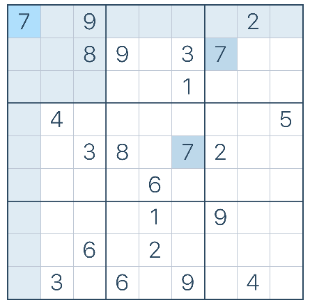

# Sudoku Solver
## Description
This is a Sudoku puzzle (9x9) solver using elimination of candidates and recursion.

## Usage
The puzzle should be a `numpy ndarray` of intergers with unfilled cells marked as `0`.  
Eg:  
  

Above puzzle should be input as a numpy ndarray  
```
import numpy as np  

puzzle = np.array([  
    [8,0,0,7,0,0,0,0,0],  
    [0,3,0,0,9,8,0,2,0],  
    [4,0,0,0,0,0,5,0,0],  
    [3,0,0,0,1,7,0,0,4],  
    [0,0,0,6,0,0,0,1,0],  
    [0,7,0,2,0,0,0,0,0],  
    [0,0,9,0,0,0,0,0,2],  
    [0,0,0,0,6,0,0,0,0],  
    [0,8,0,0,3,1,0,9,0]])
```

Import the module and use `.solve_sudoku(puzzle)` to initiate solving.

```
import sudoku as sk  

solved_puzzle, remaining_cells = sk.solve_sudoku(puzzle)
```
It returns a tuple containing the solved puzzle and remaining cells to be filled. If a puzzle is solved. `remaining_cells` would be 0.  

## References

1. The example puzzle was generated using [sudoku.com](https://sudoku.com)